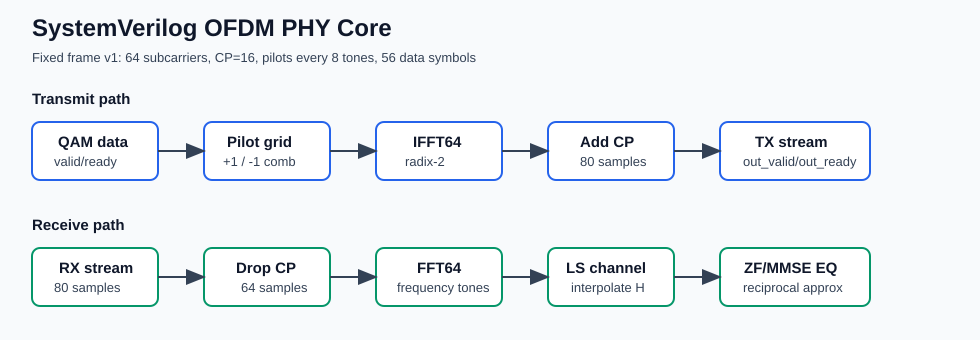
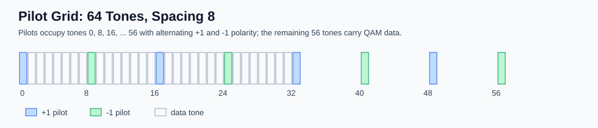
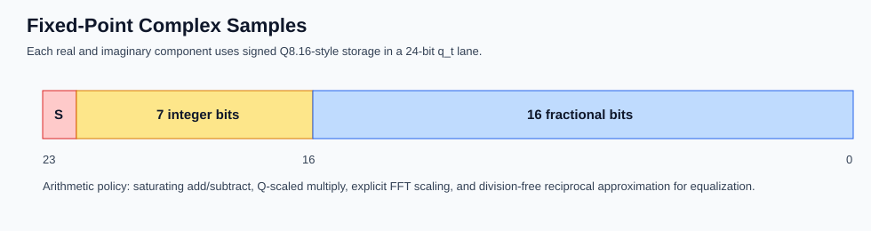
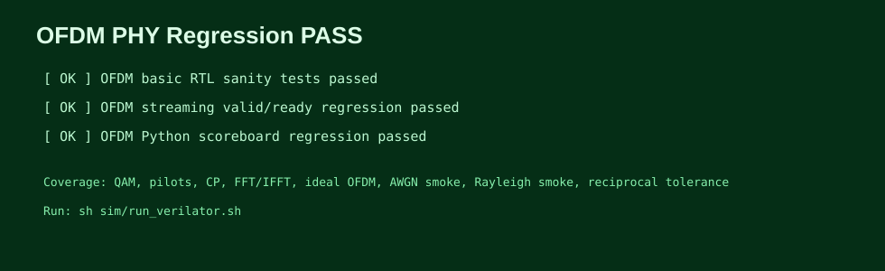
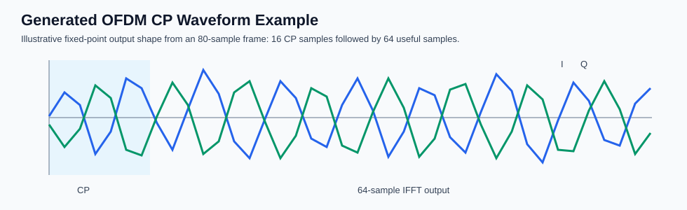

# SystemVerilog OFDM PHY Core

A fixed-point SystemVerilog OFDM physical-layer baseband core. The design
implements a compact OFDM transmit/receive datapath with frame-level modules,
valid/ready stream wrappers, deterministic regression tests, and open-source
FPGA synthesis scripts.

**Current status:** Verilator regression passing on Ubuntu WSL with OSS CAD
Suite / Verilator 5.049.



## Highlights

- 64-subcarrier OFDM with 16-sample cyclic prefix
- 56 data tones and comb pilots every 8 subcarriers
- QPSK, 16-QAM, and 64-QAM mapper/demapper
- 64-point radix-2 FFT/IFFT in portable SystemVerilog
- Pilot-aided LS channel estimation with interpolation
- ZF/MMSE-style equalization using a division-free reciprocal approximation
- Frame-level TX/RX wrappers and fixed-length valid/ready stream wrappers
- Verilator regressions with randomized modulation, OFDM frame, AWGN, Rayleigh,
  reciprocal, and handshake tests
- iCE40UP5K synthesis script and generated report location

## Verification Status

Latest local regression result:

```text
basic      PASS
streaming  PASS
scoreboard PASS
Result: PASS
```

Tested flow:

- Windows PowerShell launcher: `run.ps1` / `run.bat`
- Ubuntu WSL execution path
- OSS CAD Suite Verilator 5.049
- Three SystemVerilog testbenches: basic PHY sanity, streaming valid/ready, and
  Python-scoreboard regression

## Architecture

The core is intentionally small and inspectable: fixed defaults, no packet
framing, and no timing/CFO recovery. Frame boundaries are implied by fixed
lengths in v1.

| Parameter | Value |
| --- | ---: |
| Subcarriers | 64 |
| Cyclic prefix | 16 samples |
| Frame output length | 80 complex samples |
| Pilot spacing | 8 tones |
| Data symbols/frame | 56 |
| Fixed-point lane | signed 24-bit, 16 fractional bits |





## Streaming Interfaces

`ofdm_tx_stream` accepts 56 complex QAM symbols and outputs 80 time-domain CP
samples:

```systemverilog
input  logic clk, rst_n;
input  logic in_valid;
output logic in_ready;
input  q_t   in_data_i, in_data_q;
output logic out_valid;
input  logic out_ready;
output q_t   out_data_i, out_data_q;
```

`ofdm_rx_stream` accepts 80 CP samples and outputs 56 equalized data symbols.
It also exposes `eq_mode` and `noise_var` for ZF/MMSE behavior.

## Repository Layout

```text
rtl/       Synthesizable SystemVerilog modules
tb/        SystemVerilog regression testbenches
sim/       Verilator runners and Python scoreboard vector generator
synth/     Yosys/nextpnr synthesis scripts
reports/   Synthesis report output
docs/      Architecture notes and public assets
vectors/   Deterministic generated reference vectors
```

## One-Click Run

On Windows, double-click:

```text
run.bat
```

The script runs the Verilator regression through WSL. If your WSL distribution
is not named `Ubuntu`, set `OFDM_WSL_DISTRO` before running, or let the wrapper
fall back to your default WSL distribution.

Expected summary:

```text
Regression summary:
  basic      PASS
  streaming  PASS
  scoreboard PASS
Result: PASS
```

From Linux/WSL:

```sh
sh sim/run_verilator.sh
```



## Verification

The regression suite covers:

- QPSK, 16-QAM, and 64-QAM mapper/demapper identity
- Randomized modulation cases generated by Python
- Pilot placement and alternating pilot polarity
- CP insertion/removal
- FFT/IFFT fixed-point round trip
- Ideal-channel TX/RX recovery
- Random OFDM frame scoreboard comparison
- High-SNR AWGN behavioral vector
- Rayleigh behavioral smoke vector with bounded outputs
- Reciprocal/equalizer approximation tolerance checks
- Stream valid/ready input stalls and output backpressure
- Multiple consecutive stream frames through the same DUT instances

Reference vectors are regenerated automatically by `sim/run_verilator.sh` using:

```sh
python3 sim/generate_scoreboard_vectors.py --seed 23 --out vectors
```

## Synthesis

The synthesis target is Lattice iCE40UP5K SG48 through OSS CAD Suite:

```sh
sh synth/run_synth.sh
```

The script writes `reports/synthesis_report.md` plus Yosys/nextpnr logs and
netlists. DSP/BRAM reporting on iCE40 is target-specific, so treat the report as
an open-source FPGA estimate rather than a vendor timing signoff.

Current report location: [reports/synthesis_report.md](reports/synthesis_report.md)

## Visuals



## Scope

This is a synthesizable RTL prototype for the OFDM baseband datapath. AWGN,
Rayleigh fading, BER/SNR sweeps, CSV export, plotting, and random traffic
generation stay in software/testbench code because they are verification and
analysis infrastructure.

Not included in v1: packet framing, FEC, interleaving, synchronization, CFO
correction, timing recovery, AXI-Stream metadata, or a vendor-optimized FFT IP.
